# Algorithm-Demos
This a program that provides short demonstrations of sorting and pathfinding algorithms on randomly generated data. 
## Sorting Algorithms
Currently there are demonstrations of: Bubble Sort, Merge Sort. 
More will be implemented at a later date.
### Bubble Sort
This algorithm goes though a list and compares adjacent elements. If they are out of order they are switched. Then the algorithm moves on to the next pair of adjacent elements. Once the algorithm successfully moves completely through the list without swapping elements around, the sort is complete. Here are some screenshots of this in action:

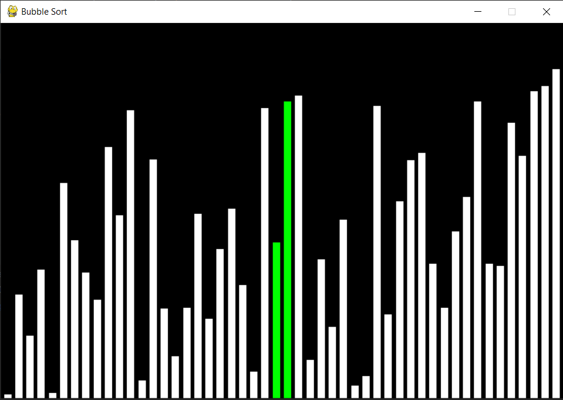
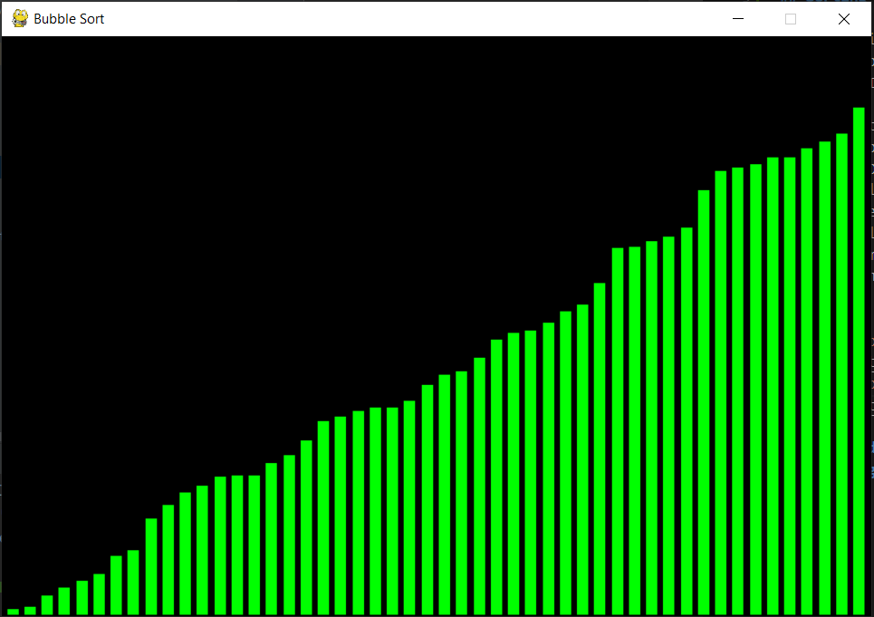

### Merge Sort
This algorithm uses 'divide-and-conquer' to split a list in two over and over until it is separated individually by each element. Then pairs of elements are compared and sorted, over and over until the list is recompiled whole. Instead of splitting the list, I opted to split by index to make the animation easily. 
Here are some screenshots of this in action:

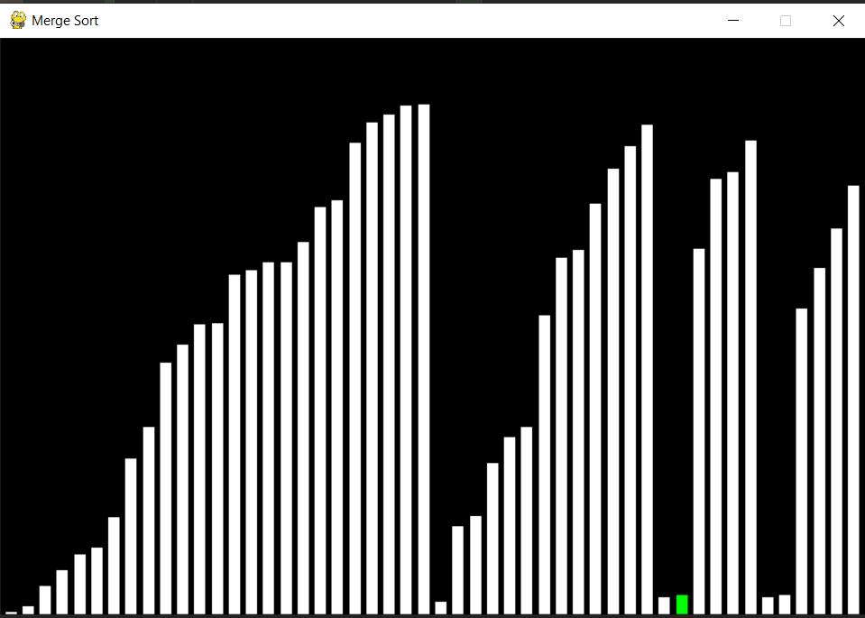
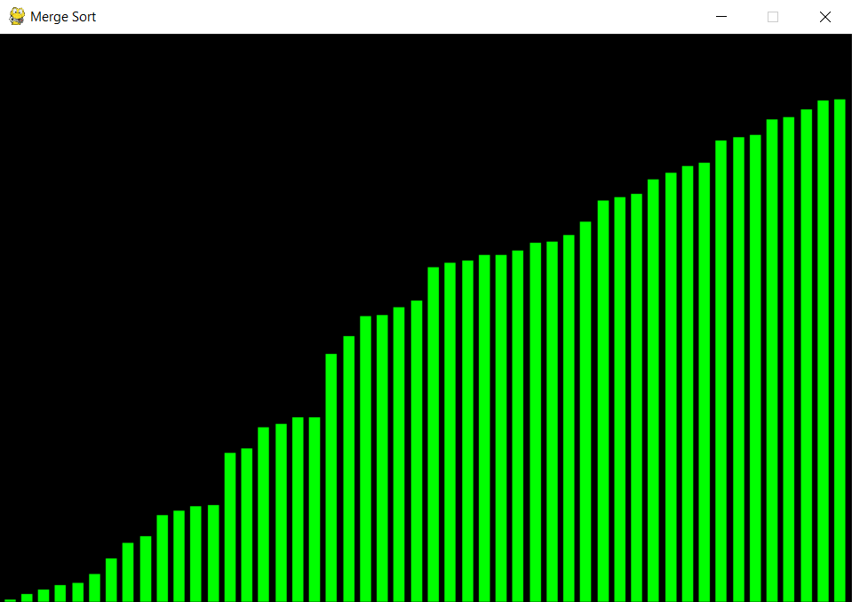

### Quick Sort
This is another 'divide-and-conquer' algorithm that is very fast (low time complexity), hence its name. The algorithm sorts by selecting pivots and moving other elements in an array segment before and after it based on its value. 
Here are some screenshots of this in action:

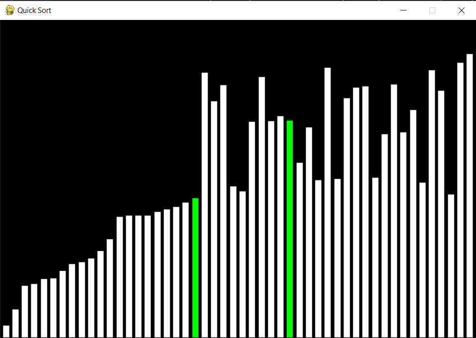
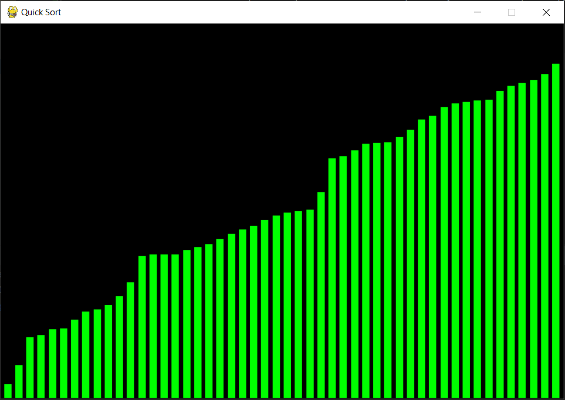
---
## Pathfinding Algorithms
Key of tiles in visualisations:
- `LIGHT GREY`: Unvisited tile
- `DARK GREY`: Wall tile
- `DARK GREEN`: Path tile (shows path between two tiles)
- `GREEN CIRCLE`: Starting tile
- `RED CIRCLE`: Ending tile

Currently, there are demonstrations of: DFS, BFS, Dijkstra's Algorithm. 
More will be implemented at a later date. 
### Depth-First Search (DFS)
DFS is a simple graph searching algorithm in which you visit a node, add it to the visited list, run DFS on all nodes neighbours.
Here are some screenshots of this in action:

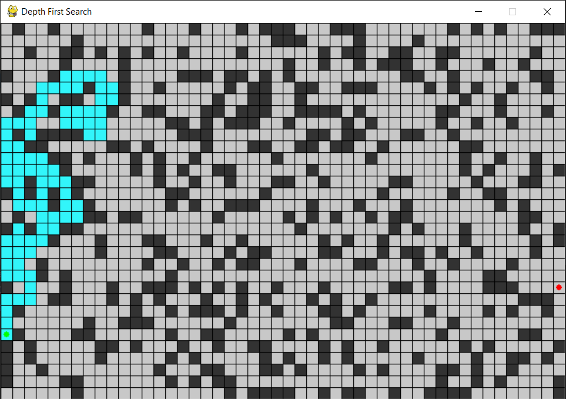
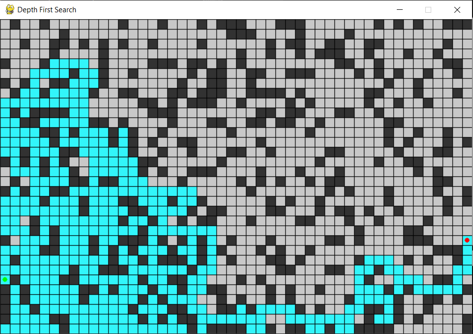

### Breadth-First Search (BFS)
BFS is a simple search algorithm in which you explore all nodes from the start one step way, then two steps, then three, until you reach the node you are looking for or run out of nodes to explore.
Here are some screenshots of this in action:

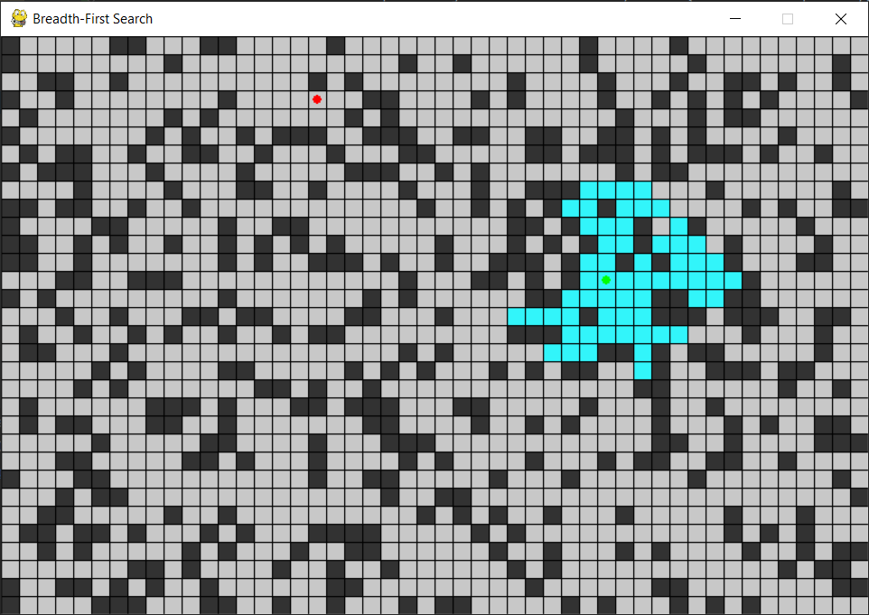
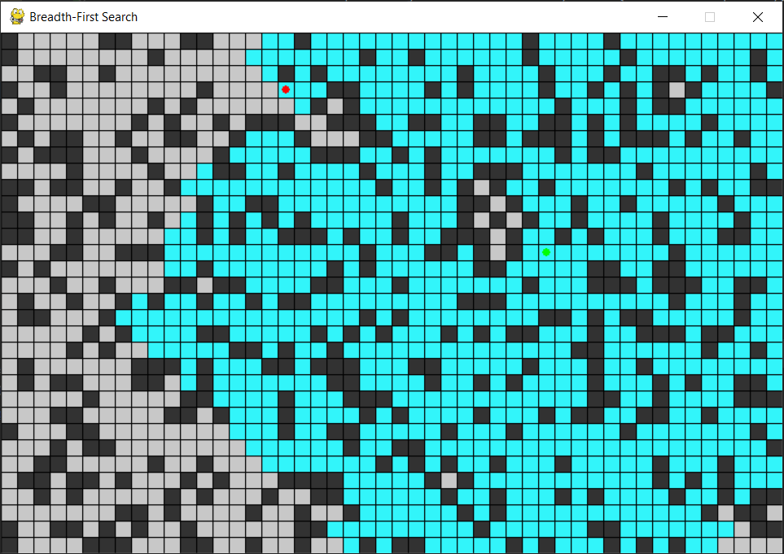

### Dijkstra's Algorithm
Dijkstra's algorithm finds the shortest path between a start node and all other nodes in a graph. In my implementation, once all nodes have been visited the path between the start node and the end node is drawn. 
Here are some screenshots of this in action:

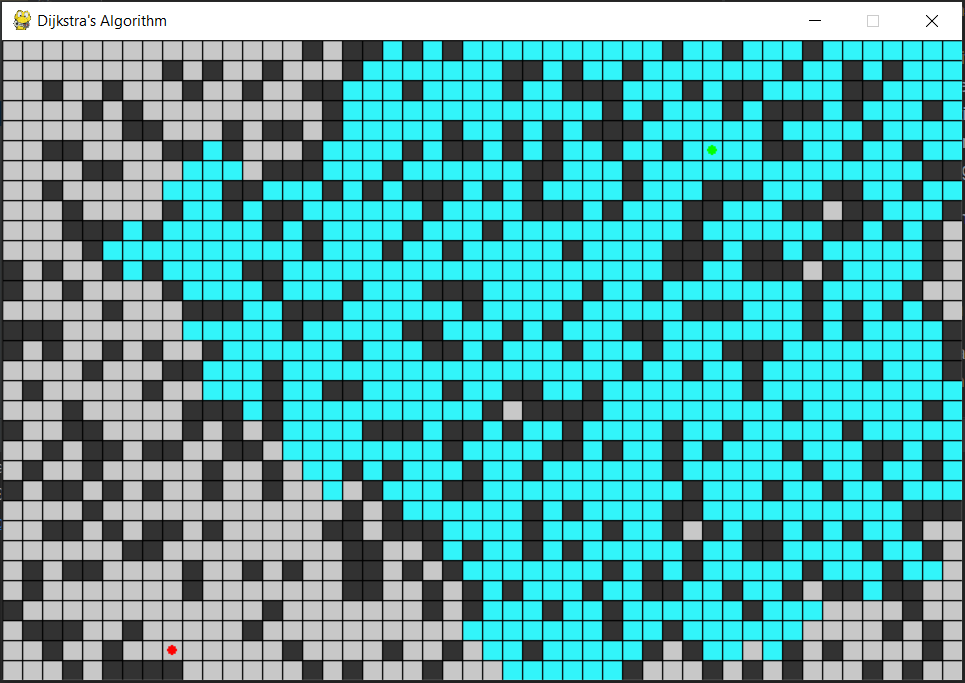
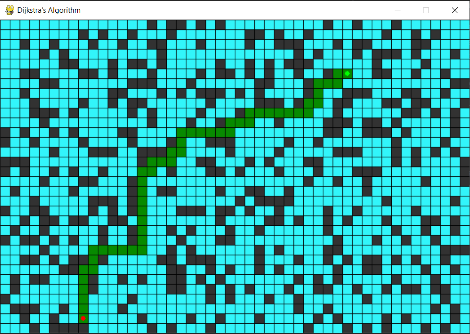

---